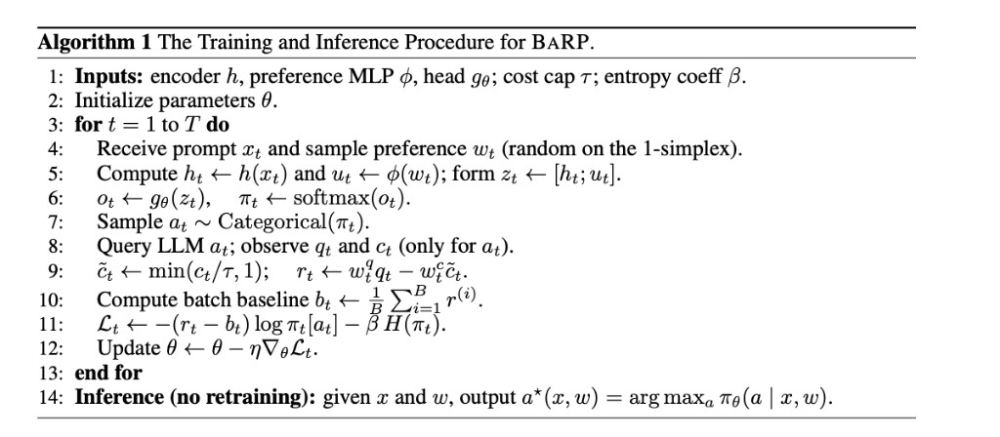

# BaRP-LLM-Routing

A from-scratch implementation of **BaRP** (Bandit Routing with Preferences)
applied to the [RouterBench](https://huggingface.co/datasets/withmartian/routerbench)
corpus of 36,497 prompts and 11 candidate LLMs.

The router is trained as a contextual bandit: at each step it sees a prompt
embedding, picks one of 11 models, and observes the chosen model's quality
score and cost (table lookup against RouterBench, no live LLM calls).

This repository ships **two versions** of the router so that the contribution
of the preference encoder is visible as a single diff:

- **Version A - BaRP without preference encoding.** A REINFORCE policy over
  prompt embeddings that maximizes raw quality. Establishes a baseline.
- **Version B - BaRP with preference MLP and cost-quality tradeoff.** Adds
  the preference encoder phi, samples preferences `w = (w_q, w_c)` on the
  1-simplex each step, and uses the cost-capped reward
  `r = w_q * q - w_c * min(c/tau, 1)`. This is the full Algorithm 1 below.



## Repository layout

```
BaRP_LLM_Routing/
  barp/                package code (models, env, trainers, eval)
  cache/               downloaded RouterBench pickle + embeddings (gitignored)
  data/                in-distribution bandit table (gitignored, built locally)
  data_ood/            OOD bandit tables (gitignored)
  experiments/         split-spec JSON configs
  runs/                training logs / checkpoints (gitignored)
  figures/             plots committed to the repo
  scripts/             setup helpers
  requirements.txt
```

## Quick start on a fresh Mac

You only need this repo. Large data files are **not** committed to GitHub;
they are downloaded and built locally (~1.1 GB download, then ~15–30 min
encoding on Apple Silicon).

```bash
git clone https://github.com/Kpaark/BaRP-LLM-Routing.git
cd BaRP-LLM-Routing

# Option A: one-shot script
bash scripts/setup_mac.sh

# Option B: manual steps
python3 -m venv .venv
source .venv/bin/activate
pip install -r requirements.txt
python -m barp.setup_data --all
```

What `--all` does:

1. Downloads `routerbench_raw.pkl` from Hugging Face into `cache/`
2. Encodes all prompts with MPNet (`cache/embeddings.npy`)
3. Builds bandit tables: `data/`, `data_ood/`, `data_ood_hard/`, `data_gsm8k_only/`

No API keys are required for training. You only need a Hugging Face account
if the dataset download prompts for login (the public RouterBench dataset is
free).

### Train and evaluate

```bash
source .venv/bin/activate

# Version B — in-distribution BaRP
python -m barp.train --data-dir data --out-dir runs/id_full --steps 10000 --seed 42

# Evaluate (replace <ts> with the timestamp folder under runs/id_full/)
python -m barp.eval_table --data-dir data --checkpoint runs/id_full/<ts>/policy.pt

# Hard OOD: train on everything except GSM-8K, test on GSM-8K only
python -m barp.train --data-dir data_ood_hard --out-dir runs/ood_hard_gsm8k --steps 10000
python -m barp.eval_table --data-dir data_ood_hard --checkpoint runs/ood_hard_gsm8k/<ts>/policy.pt
```

Optional Weights & Biases logging: add `--wandb` after `wandb login`.

### Version A baseline (no preference encoder)

```bash
python -m barp.train_nopref --data-dir data --out-dir runs/nopref --steps 10000
python -m barp.eval --checkpoint runs/nopref/<ts>/policy.pt
```

## Data setup (step by step)

If you prefer to run setup in stages:

```bash
source .venv/bin/activate

# 1) Download RouterBench + build prompts.csv
python -m barp.setup_data --download

# 2) Encode prompts (uses MPS on Apple Silicon when available)
python -m barp.setup_data --encode

# 3) Build all experiment bandit tables
python -m barp.setup_data --tables
```

Rebuild a single experiment without redoing download/encode:

```bash
python -m barp.build_bandit_table --config experiments/ood_hard_gsm8k.json --out-dir data_ood_hard
```

## What is gitignored (and why)

| Path | Size (approx.) | How to recreate |
|---|---|---|
| `cache/routerbench_raw.pkl` | ~1.1 GB | `python -m barp.setup_data --download` |
| `cache/embeddings.npy` | ~110 MB | `python -m barp.setup_data --encode` |
| `data/X.npy` | ~107 MB | `python -m barp.setup_data --tables` |
| `runs/*/policy.pt` | small | `python -m barp.train ...` |

GitHub rejects files over 100 MB, so these must be generated on each machine.

## Legacy sibling-repo layout (optional)

If you already maintain the separate `RouterBench_stats/` and
`routerbench_gmm/` repos, you can still point `build_bandit_table` at their
outputs:

```bash
python -m barp.build_bandit_table \
  --pkl ../RouterBench_stats/data/routerbench_raw.pkl \
  --embeddings ../routerbench_gmm/data/embeddings.npy \
  --ids ../routerbench_gmm/data/embeddings.ids.csv
```

The recommended path for new collaborators is `python -m barp.setup_data --all`.

## Mapping to Algorithm 1

| Line | Symbol | Implementation |
|---|---|---|
| 1 | encoder h | Frozen MPNet from `barp.setup_data`, loaded as cached `data/X.npy` |
| 1 | preference MLP phi | `barp.model.BaRP.phi` (Version B only) |
| 1 | head g_theta | `barp.model.BaRP{NoPref,}.head` |
| 1 | cost cap tau | CLI flag `--tau` (Version B) |
| 1 | entropy coeff beta | CLI flag `--beta` |
| 4 | sample w on 1-simplex | `Dirichlet([1,1]).sample()` (Version B) |
| 5 | z = [h; u] | `torch.cat([h, phi(w)], dim=-1)` (Version B) |
| 6 | pi = softmax(o) | `logits.softmax(-1)` |
| 7 | a ~ Categorical(pi) | `torch.distributions.Categorical(pi).sample()` |
| 8 | observe q, c only for a | `barp.env.RouterBenchBandit.observe(a, idx)` |
| 9 | r = w_q q - w_c min(c/tau, 1) | reward in `barp.train` (Version B; reduces to `r = q` in Version A) |
| 10 | batch baseline b | `r.mean()` |
| 11 | loss with entropy bonus | `-((r - b).detach() * logp).mean() - beta * H.mean()` |
| 14 | inference: argmax pi | `barp.eval_table` |

## References

1. RouterBench: Hu et al., *A Benchmark for Multi-LLM Routing System*,
   arXiv:2403.12031, 2024.
2. BaRP paper: *citation pending - add when finalized*.
